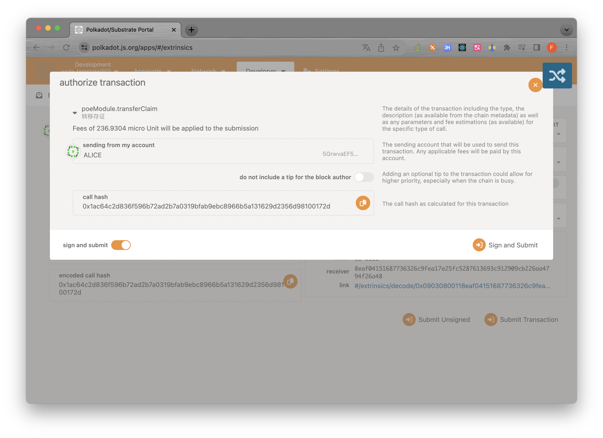
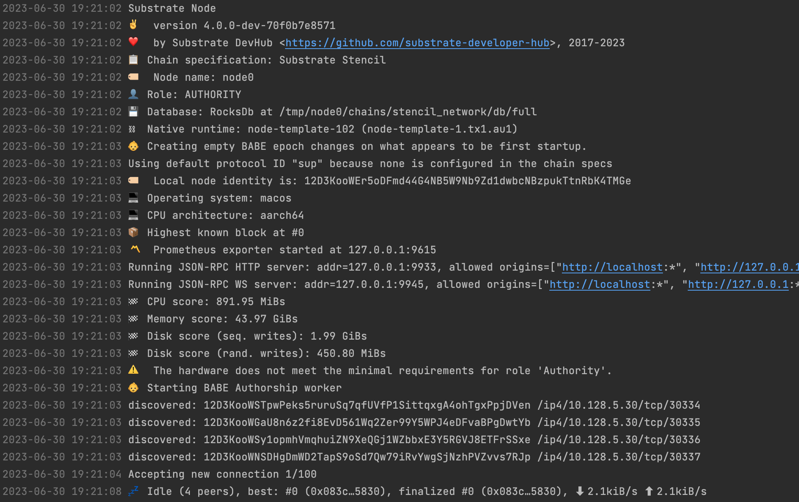

## 为 proof of existence (poe) 模块的可调用函数 create_claim, revoke_claim, transfer_claim 添加 benchmark 用例，并且将 benchmark 运行的结果应用在可调用函数上；

[pallets/poe/src/benchmarking.rs](./pallets/poe/src/benchmarking.rs)

[pallets/poe/src/lib.rs](./pallets/poe/src/lib.rs)

原先fees是90+，现在是236+，且创建、转移、撤销的fees均不相同


## 选择 node-template 或者其它节点程序，生成 Chain Spec 文件（两种格式都需要）；

[kictto-chain-raw.json](./kictto-chain-raw.json)

[kictto-chain.json](./kictto-chain.json)

## （附加题）根据 Chain Spec，部署公开测试网络

[部署脚本](./scripts/)

```shell
./script/build_chain_spec.sh
# 构建chain_spec文件，两种格式
./node_boot_start.sh
# 启动boot节点
./node_validator_x_start.sh
# 启动第x个validator节点
./insert_keys.sh
# 插入各个Key
```



